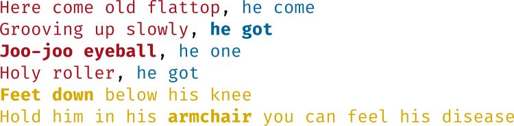

# Come Together

*On Twitter [@rightnow0verme](https://twitter.com/rightnow0verme)!*

A Twython-powered Twitter bot that randomly generates Come Together verses.

> My favorite “whistle while you work” improv game is never-ending random “Come Together” verse, I go for hours sometimes
> --[@virtjk](https://twitter.com/virtjk) (Jake Kaufman, musician and composer)

I caught the bug.

[@tmnt_wiki](https://twitter.com/tmnt_wiki) (code [here](https://github.com/catleeball/tmnt_wikipedia_bot/)) does something similar, and led me to implement this using the [pronouncing library](https://pypi.org/project/pronouncing/).

# Installing locally

Python 3.8.1 is being used in development, via pyenv. Ensure that Python 3.8 is installed.

Install the dependencies with `pip install -r requirements.txt`.

If you don't wish to tweet, replace the call to `tweet_one()` with `print(pretty_print())`. If you do...

Create a Twitter app at [apps.twitter.com](https://apps.twitter.com). Create a file in this directory called `.env`, and make it executable with `chmod +x .env`. Set the following environment variables to the values given in the tokens section for your app:

```
export TWYTHON_APP_KEY=
export TWYTHON_APP_SECRET=
export TWYTHON_OAUTH_TOKEN=
export TWYTHON_OAUTH_TOKEN_SECRET=
```

Now, you can run the script with `source .env && python rightnow.py`. Expect it to tweet to the account you've configured once with a funky-fresh verse!

# Development

## How does it work?

Let's have a look at the lyrics.



The highlighted words are what those parts of the verse are referred to as internally to the code. I chose these names because it helps you to be aware of the purpose, location of, and required syllables for each part.

### "He got"

A pronoun (e.g. he, she, they) and another word (e.g. got, one, come) are combined.

#### Exceptions

The first line may start with just a pronoun as in the last verse ("he rollercoaster"). "He/she/they come" increases the syllable limit by two if it's on the first line as in "he come grooving up slowly".

### "Joo-joo eyeball"

A random phrase that's usually four syllables long, but can vary by one either way depending on circumstance.

It's calculated as follows:

1. Find an existing joo-joo eyeball for the amount of syllables needed to satisfy that part of the line.
2. Take each word's stresses, and find a random word with the same stresses (and by proxy the same syllables).
3. Replace the phrase with the result.

It's calculated the same way in every instance, but the results will differ depending on how many syllables are necessary to satisfy the meter of what a line should look like.

### "Feet down" and "armchairs"

**Note:** This is currently being experimented with. The current method is detailed below.

In both instances, we take one existing feet-down and armchair, and replace each word with something that rhymes and has the same number of syllables. Often, it comes out looking like you're singing the line in a bizarre accent, occasionally with funny word replacements on "armchair". I'm rethinking this in favour of just mad-libbing the nouns or phrases (e.g. "feel his disease") for something that rhymes. This way, we get the comedy of random generation, enhanced by the familiarity of keeping the structure of the lyrics.

## Contributing

I strongly welcome and encourage PRs to this repo. Keep an eye on the issues page to see what needs doing!